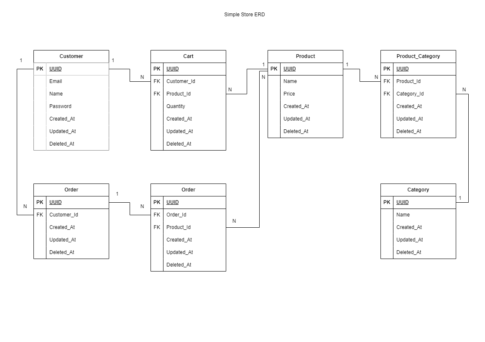

# Simple Store API 

Simple store API provide a simple CRUD Backend API for a store. This API will provide functions such as:

- Login and Register for Customer.
- Customer can get all product list and get product list based on categories.
- Customer can add and delete item into their own cart
- Customer can create an order from their cart
- Customer authentication using JWT

### Tech Stack
- Go
- Postgress Database
- [Chi](https://go-chi.io/#/) Routing
- [GORM](https://gorm.io/index.html) Database ORM

### Database Entity Relationship Diagram


### Project Setup
1. Clone the project 
2. Prepare the enviroment
3. Migrate database scheme, run "go run src/migration/migration.go"
4. Project is ready.

### Route Endpoint

1. Login:
    - Path : /api/v1/register 
    - Method : POST
    - Request Body : 
        ```JSON
        {
            "email" : "user@email.com",
            "name" : "User Name",
            "Password" : "Password"
        }
        ```
    - Response :
        - Success :
            ```JSON
            {
                "token": "JWT Token",
                "customer": {
                    "ID":"UUID",
                    "email": "user@email.com",
                    "name": "User Name"
                }
            }

            ```
        - Failed : 
            ```JSON
            {
                "Message": "Password Wrong"
            }
            ```

2. Register
    - Path : /api/v1/register
    - Method : POST
    - Request Body:
        ```JSON
        {
            "email" : "user@gmail.com",
            "name" : "User Name",
            "Password" : "Password"
        }
        ```
    - Response:
        - Success : 
        ```JSON
        {
            "Message": "User Created"
        }
        ```
        - Failed :
        ```JSON
        {
            "Message": "Email already used"
        }
        ```

3. Get All Product
    - Path : /api/v1/product
    - Method : GET
    - Request Head : "Authorization" : "Bearer Token"
    - Response : 
    ```JSON
    [
        {
            "ID": "831870ab-6516-4402-8573-8944edd1c59d",
            "name": "Kassulke-Kassulke",
            "price": 92131, //INT
            "description": "Lorem Ipsum"
        },
    ]
    ```

4. Get Product by Category
    - Path : /api/v1/product/{Categories} (replace Categories with categories name)
    - Method : GET
    - Request Head : "Authorization" : "Bearer Token"
    - Response :
     ```JSON
     // Category : "Electronic", "Home", "Appliance", "Kitchen", "Food"
    [
        {
            "ID": "831870ab-6516-4402-8573-8944edd1c59d",
            "name": "Kassulke-Kassulke",
            "price": 92131, //INT
            "description": "Lorem Ipsum"
        },
    ]
    ```

5. Get All Cart
    - Path : /api/v1/cart
    - Method : GET
    - Request Head : "Authorization" : "Bearer Token"
    - Response : 
    ```JSON
    [
        {
            "ID": "d63f7ebb-9a37-4253-b8b4-2fa09fb27fba", //Customer Cart Id contain 1 item
            "product": {
                "ID": "b0479a58-fb5a-4513-9a50-71f700356c0e",
                "name": "Corkery, Corkery and Corkery",
                "price": 82432,
                "description": "Lorem Ipsum"
            },
            "quantity": 2
        },
    ]
    ```
6. Add Cart
    - Path : /api/v1/cart
    - Method : POST
    - Request Head : "Authorization" : "Bearer Token"
    - Request Body : 
    ```JSON
    {
        "productId" : "831870ab-6516-4402-8573-8944edd1c59d",
        "quantity" : 200
    }
    ```
    - Response :
        - Success : 
        ```JSON
        {
            "Message": "Added to cart"
        }
        ```
        - Failed : 
        ```JSON
        {
            "Message": "Failed to add to cart"
        }
        ```

7. Delete Cart 
    - Path : /api/v1/cart?id=cartId
    <br> Cart ID is the id of the cart that customer want to delete
    - Method : Delete
    - Request Head : "Authorization" : "Bearer Token"
    - Response :
        - Success : 
        ```JSON
        {
            "Message": "Item deleted"
        }
        ```
        - Failed : 
        ```JSON
        {
            "Message": "Invalid cart id"
        }
        ```

8. Crate Order
    - Path : /api/v1/order
    - Method : POST
    - Request Head : "Authorization" : "Bearer Token"
    - Request Body :
    ```JSON
    {
        "cartId" : ["9bf64a26-dd8c-4b54-a21b-23fac4535115","7114610f-c3d7-49f3-86c7-304e7f67da5a"]
    }
    //CartId is array of cart id , 1 order can contain multiple cart or item
    ```
    - Response: 
        - Success :
        ```JSON
        {
            "Message": "Order Create"
        }
        ```

        - Failed :
        ```JSON
        {
            "Message": "Invalid Request"
        }
        ```

9. Get All Order
    - Path : /api/v1/order
    - Method : POST
    - Request Head : "Authorization" : "Bearer Token"
    - Response : 
    ```JSON
    [
        {
            "orderId": "cd8bbeeb-df82-4275-a912-918ba70c4c8f",
            "totalPrice": 36852400,
            "products": [
                {
                    "product": {
                        "ID": "831870ab-6516-4402-8573-8944edd1c59d",
                        "name": "Kassulke-Kassulke",
                        "price": 92131,
                        "description": "Lorem Ipsum"
                    },
                    "quantity": 200
                },
                {
                    "product": {
                        "ID": "831870ab-6516-4402-8573-8944edd1c59d",
                        "name": "Kassulke-Kassulke",
                        "price": 92131,
                        "description": "Lorem Ipsum"
                    },
                    "quantity": 200
                }
            ]
        },
    ]
    ```


    
        

